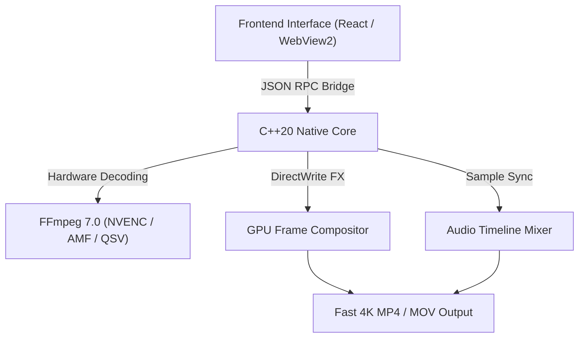

# X-CUT — Ultra-Fast 4K Hardware-Accelerated NLE Video Editor

---

## ⚡ What is X-CUT?

**[X-CUT](https://xcut.outgrave.com/)** is a modern, next-generation, non-linear video editing software (NLE) engineered for creators, editors, and filmmakers who demand extreme speed, zero-latency timeline performance, and professional-grade rendering capabilities on Windows.

Built with a hyper-optimized **C++20 native video composition core**, **FFmpeg 7.0 hardware codecs**, and a sleek **Microsoft WebView2 modern user interface**, X-CUT delivers real-time 4K 60FPS preview playback, multi-track audio mixing, and instant export rendering.

👉 **Get started today at [https://xcut.outgrave.com/](https://xcut.outgrave.com/)**

---

## 🚀 Key Features & Highlights

### ⚡ 1. Native C++ Hardware Acceleration
- **GPU Acceleration**: Built-in support for **NVIDIA NVENC**, **AMD AMF**, and **Intel QSV** hardware encoding & decoding.
- **Instant 4K Export**: Render high-bitrate H.264/HEVC/AV1 videos up to **5x faster** than traditional software editors.
- **Ultra-Low Memory Footprint**: C++ native memory management guarantees zero RAM bloat during intense timeline editing.

### 🎨 2. Multi-Track Timeline & Real-Time Compositing
- Unlimited video, audio, text, and overlay tracks.
- Frame-accurate trimming, splitting, ripple editing, speed ramps, and transform keyframing.
- Smooth real-time transitions (Fade, Wipe, Slide, Zoom, Glitch, Dissolve) rendered direct on the GPU.

### 🎵 3. High-Fidelity Audio Engine
- Sample-accurate multi-channel audio mixing and waveform rendering.
- Automatic audio-video sync lock prevents drift during long 4K project exports.
- Support for WAV, MP3, AAC, FLAC, and multi-track spatial audio tracks.

### 🔤 4. DirectWrite Motion Typography & FX
- Native Windows **DirectWrite text engine** for crisp vector text rendering at any resolution.
- Dynamic title templates, lower thirds, custom subtitles, and animated captions.

---

## 📊 Technical Architecture

---

## 💻 System Requirements

| Specification | Minimum Requirement | Recommended for 4K |
| :--- | :--- | :--- |
| **OS** | Windows 10/11 (64-bit) | Windows 11 (64-bit) |
| **Processor** | Intel Core i5 8th Gen / AMD Ryzen 5 | Intel Core i7/i9 12th Gen / AMD Ryzen 7/9 |
| **RAM** | 8 GB RAM | 16 GB+ RAM |
| **Graphics** | DirectX 11 / OpenGL 4.5 compatible GPU | NVIDIA RTX 2060 / AMD RX 6600 or better |
| **DirectX** | Version 11 | Version 12 |
| **Storage** | 500 MB free space (SSD) | NVMe SSD for 4K Media Scratch Disk |

---

## 🌐 Official Download & Links

- **Official Website**: [https://xcut.outgrave.com/](https://xcut.outgrave.com/)
- **Documentation**: [https://xcut.outgrave.com/docs](https://xcut.outgrave.com/)
- **Release Notes**: [https://xcut.outgrave.com/releases](https://xcut.outgrave.com/)

---

## ❓ Frequently Asked Questions (FAQ)

### Is X-CUT free to download?
Yes! You can download and install X-CUT directly from our official portal at **[https://xcut.outgrave.com/](https://xcut.outgrave.com/)**.

### Does X-CUT support NVIDIA NVENC hardware acceleration?
Absoltely. X-CUT automatically detects NVIDIA GPUs and uses NVENC hardware acceleration for high-speed video encoding and decoding.

### How does X-CUT compare to traditional NLE software?
Unlike legacy video editors that suffer from memory leaks and heavy background processing, X-CUT couples a lightweight C++ engine directly with modern web UX technologies to ensure peak FPS during editing and rendering.

---

*Copyright © 2026 X-CUT Studio / Outgrave. All rights reserved. Visit [xcut.outgrave.com](https://xcut.outgrave.com/) for more information.*
